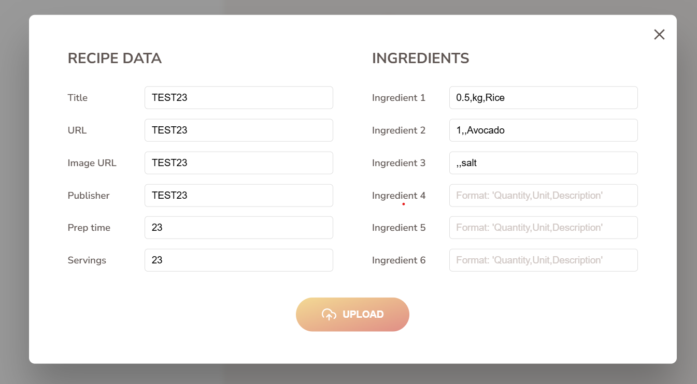
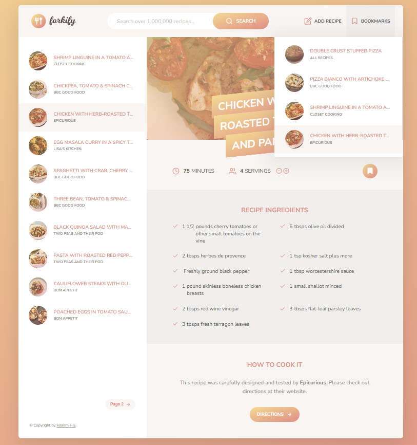

<h1 align="center">
  🍴 Forkify Project
  <br />
  
  
  
</h1>

<p align="center">
  A sleek recipe search application built using modern JavaScript and Webpack, allowing users to find, view, and bookmark recipes in real-time. 🔎🍳
</p>

---

## 🚀 Demo

🔗 [Live Demo Here](https://forkify-fe.netlify.app/) (Add your deployed link here if available)

---

## 📸 Screenshots

| Home Page | Recipe View | Bookmarks |
|----------|-------------|-----------|
|  |  |  |

---

## 🧰 Tech Stack

- **Vanilla JavaScript (ES6+)**
- **HTML5 / SCSS**
- **Webpack (Bundling)**
- **Forkify API (from Jonas Schmedtmann’s course)**

---

## ✨ Features

✅ Search for recipes  
✅ View detailed cooking instructions  
✅ Adjust servings dynamically  
✅ Bookmark favorite recipes  
✅ Responsive design  

---

## 📂 Folder Structure

```bash
forkify/
│
├── src/
│   ├── js/
│   │   ├── controller.js
│   │   ├── model.js
│   │   ├── views/
│   │   └── helpers.js
│   ├── sass/
│   └── index.html
│
├── dist/
├── .babelrc
├── webpack.config.js
└── README.md
